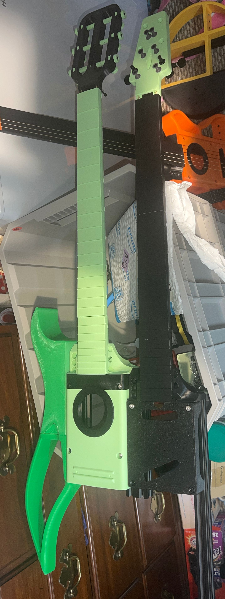

# ExoGuitar
This is the Repo for the ExoGuitar project

## Documentation

- [Assembly Documentation](./ASSEMBLY.md)
- [How to Contribute](./CONTRIBUTING.md)

## MakerWorld Listings

This is a MakerWorld exclusive project; so all print profiles are hosted and maintained there.

[MakerWorld Collection](https://makerworld.com/en/collections/4170197-exoguitar)

### Wing Sets:
- [More Paul](https://makerworld.com/en/models/1162982-exoguitar-wings-more-paul)
- [Banj-No](https://makerworld.com/en/models/1158493-exoguitar-wings-banj-no)
- [Less Paul](https://makerworld.com/en/models/1158385-exoguitar-wings-less-paul)
- [Rich](https://makerworld.com/en/models/1078060-exoguitar-wings-rich)
- [Firebird](https://makerworld.com/en/models/988586-exoguitar-wings-firebird)
- [Cyber Butterfly](https://makerworld.com/en/models/946179-exoguitar-cyber-butterfly-wings)
- [Warlock](https://makerworld.com/en/models/1391383-exoguitar-wing-set-warlock)

### Necks
- [Printed Frets](https://makerworld.com/en/models/1158373-exoguitar-neck-printed-frets)
- [Metal Frets](https://makerworld.com/en/models/977913-exoguitar-neck)

### Cores
- [Acoustic Core](https://makerworld.com/en/models/1155233-exoguitar-acoustic-core)
- [Core V2](https://makerworld.com/en/models/981210-exoguitar-core-v2)
- [Core V1](https://makerworld.com/en/models/887441-exoguitar-core)

### Bridge
_Saddle and Anchor combined_
- [Headless](https://makerworld.com/en/models/988538-exoguitar-headless-bridge-plate)
- [Bearing Bridge](https://makerworld.com/en/models/969432-exoguitar-bearing-bridge)
- [Alnicov Saddle](https://makerworld.com/en/models/946216-exoguitar-bridge-alnicov-saddle-headless)

### Saddle
- [Tune O' Matic](https://makerworld.com/en/models/1288679-exoguitar-saddle-tune-o-matic#profileId-1318404)

### Anchor
- [Flat Top Tremolo](https://makerworld.com/en/models/1288644)

### Head
- [Classical Head](https://makerworld.com/en/models/1158327-exoguitar-classical-head-printed-tuners)
- [Arrow](https://makerworld.com/en/models/977949-exoguitar-head)
- [Headless](https://makerworld.com/en/models/977972-exoguitar-headless-adjustable-nut)
- [Jack's Son](https://makerworld.com/en/models/1223137-exoguitar-head-jack-s-son)
- [Explorer](https://makerworld.com/en/models/1242688-exoguitar-head-explorer)
- [Less Paul](https://makerworld.com/en/models/1242379-exoguitar-head-less-paul)
- [King Paul](https://makerworld.com/en/models/1405761-exoguitar-head-king-paul)
- [Firebird](https://makerworld.com/en/models/1242697-exoguitar-head-firebird)

### Extras 
- [Stealth Plate v2](https://makerworld.com/en/models/946400-exoguitar-stealth-plate-v2)
- [Strap](https://makerworld.com/en/models/1154218-exoguitar-strap)
- [Dials](https://makerworld.com/en/models/946440-exoguitar-spiral-dials-and-switch)
- [Strap Hooks](https://makerworld.com/en/models/965746-exoguitar-strap-hooks-wall-mount)
- [Fret Press Jig](https://makerworld.com/en/models/965720-exoguitar-fret-press-jig)
- [Bow](https://makerworld.com/en/models/1285015-exoguitar-bow)

## Multi-Neck Configuration

The sides of the core are made out of 2020 aluminum extrusion and the core terminates exactly along the edge of it.  It was not indended from the beginning, but it DOES allow you to swap out the 2020 for 2040 aluminum extrusion to attach 2 or more cores together to create multiple neck guitars. 

I haven't made a Wing Set specifically for this purpose yet, but the BC Rich may be a good fit for it.  

